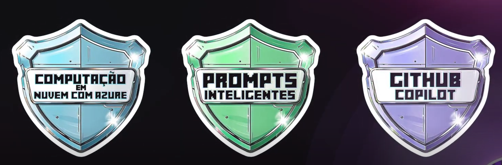

# Message about this documentation

To be clear. The content here is a content based on a free course. Noone can reproduce this material. If you wanna to know this material, my advice is to you access the [free course](https://www.dio.me/bootcamp/microsoft-50-anos-prompts-inteligentes). And if they end the course or start to ask money to study in the course? Well, this considerations are out of my control, but the DIO material is excelent! If you acquire a DIO paln, you will have access to amazing courses.

# Free courses

# Textual official documentation

[link](https://web.dio.me/track/microsoft-50-anos-prompts-inteligentes/course/introducao-a-engenharia-de-prompts/learning/5207ae1d-1643-4865-b703-e0c0f3fac1ae?autoplay=1&back=%2Ftrack%2Fmicrosoft-50-anos-prompts-inteligentes)

# Article citted in the course

The name of the article is "[Attention is all we need](https://proceedings.neurips.cc/paper_files/paper/2017/file/3f5ee243547dee91fbd053c1c4a845aa-Paper.pdf)". [Wikipedia link](https://pt.wikipedia.org/wiki/Attention_Is_All_You_Need) about this aticle.

# Random comments

Teacher explanind that the transformer architechture do not process a phrase in a linear sequence. It tries to discovery informations of each word in the text in other parts of the text.