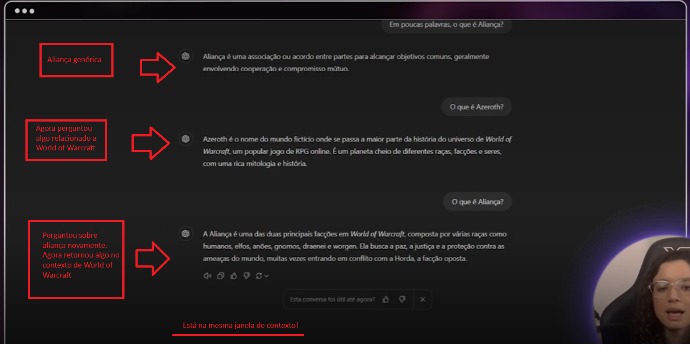
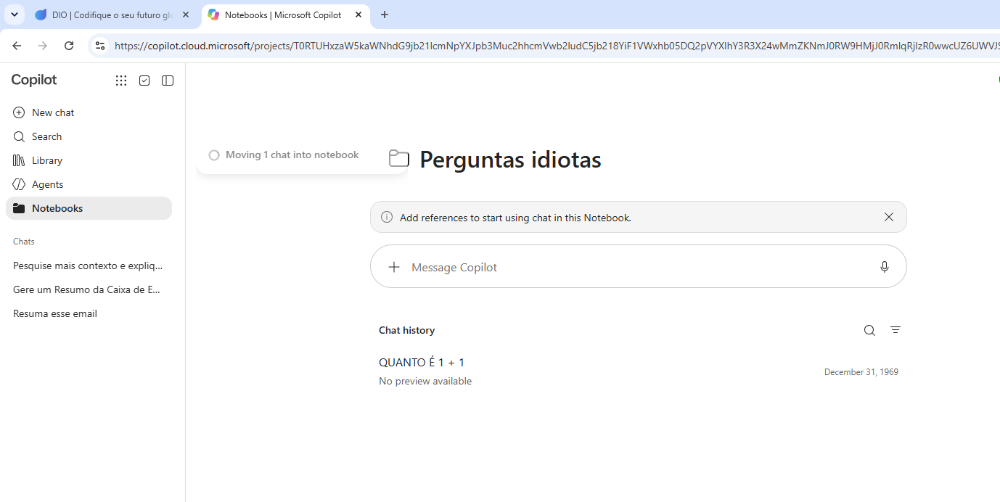
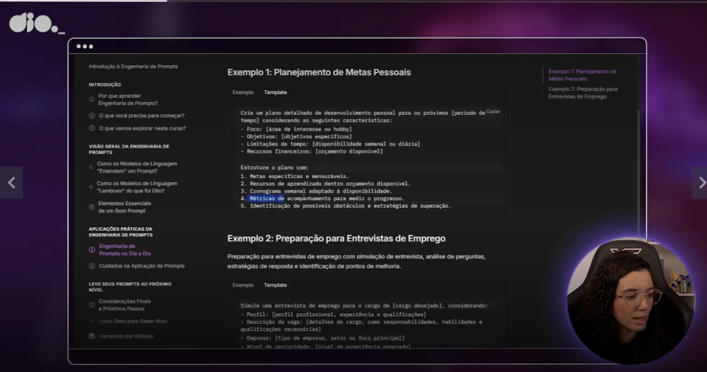
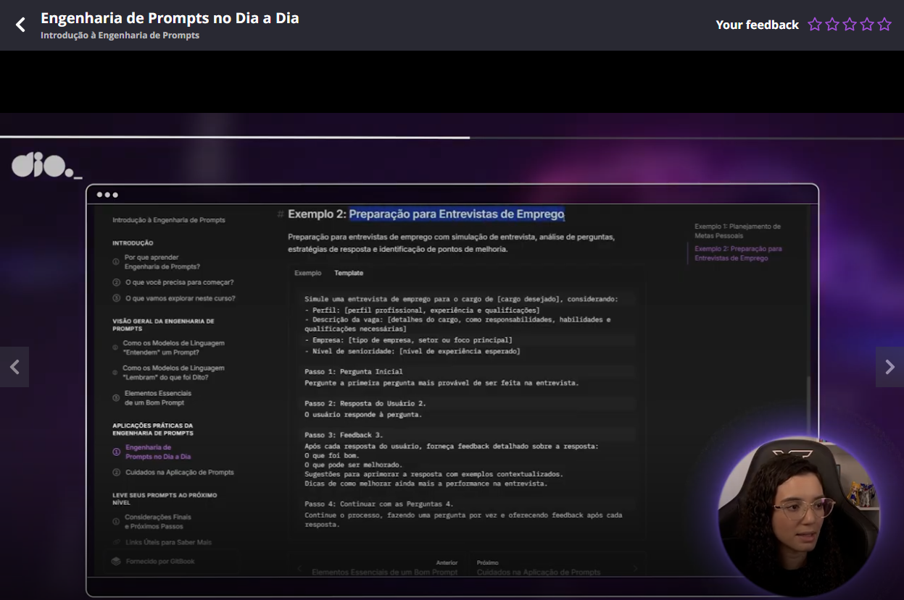
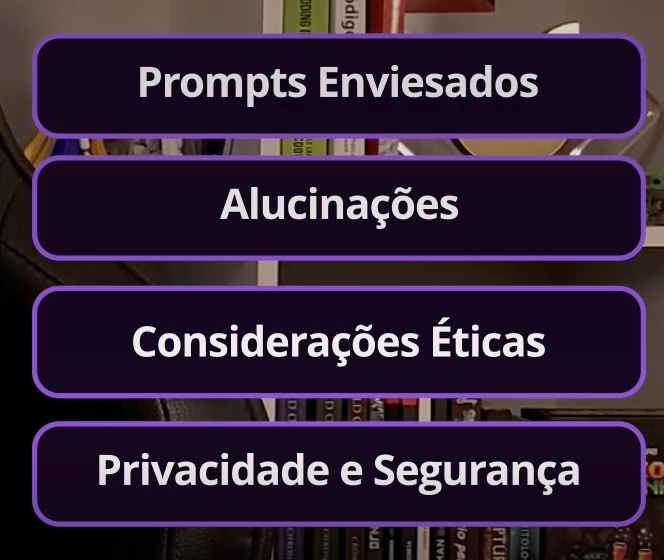
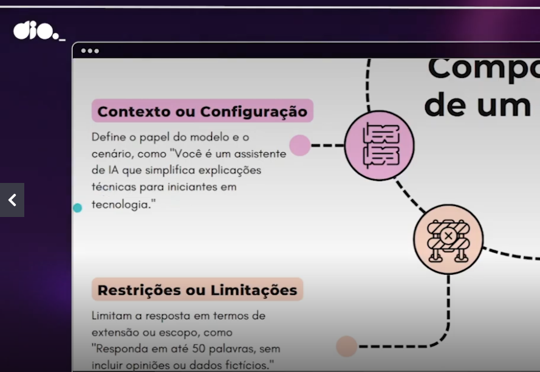
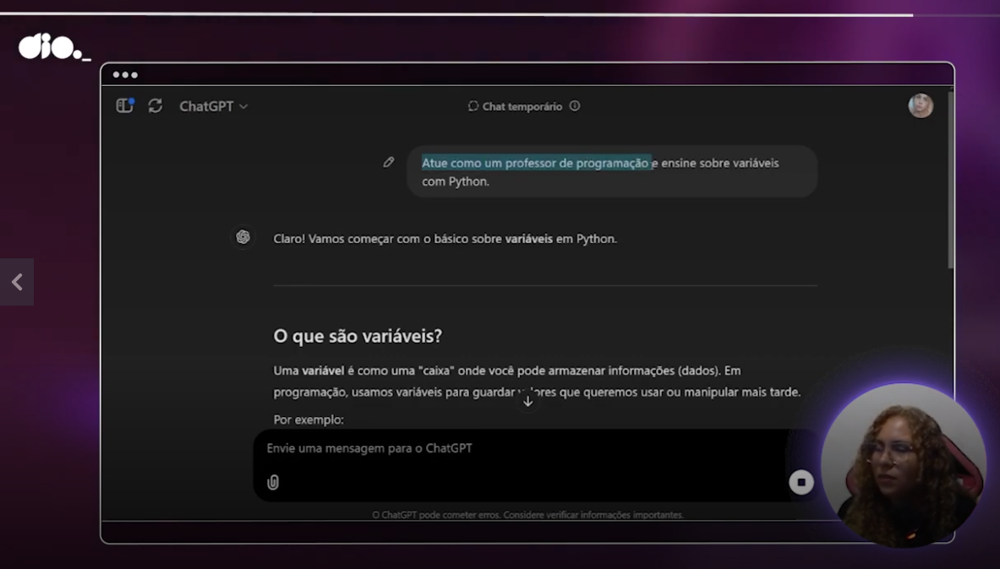
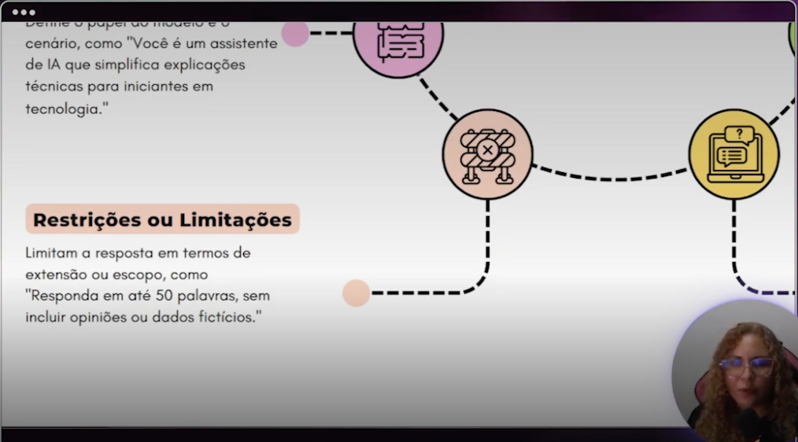

# Message about this documentation

To be clear. The content here is a content based on a free course. Noone can reproduce this material. If you wanna to know this material, my advice is to you access the [free course](https://www.dio.me/bootcamp/microsoft-50-anos-prompts-inteligentes). And if they end the course or start to ask money to study in the course? Well, this considerations are out of my control, but the DIO material is excelent! If you acquire a DIO paln, you will have access to amazing courses.


# Free courses


# Textual official documentation

[link](https://web.dio.me/track/microsoft-50-anos-prompts-inteligentes/course/introducao-a-engenharia-de-prompts/learning/5207ae1d-1643-4865-b703-e0c0f3fac1ae?autoplay=1&back=%2Ftrack%2Fmicrosoft-50-anos-prompts-inteligentes)


# Article citted in the course

The name of the article is "[Attention is all we need](https://proceedings.neurips.cc/paper_files/paper/2017/file/3f5ee243547dee91fbd053c1c4a845aa-Paper.pdf)". [Wikipedia link](https://pt.wikipedia.org/wiki/Attention_Is_All_You_Need) about this aticle.


# Random comments

Teacher explanind that the transformer architechture do not process a phrase in a linear sequence. It tries to discovery informations of each word in the text in other parts of the text. Teacher described this part as how "transformer attention mechanism" destak relevant parts to the context, resulting in an analysis more precise and quick.


# How the models process the prompts?

When you provide a prompt to a language model it converts the text in a token sequence, that are a basic unit that can be a word, oarts of words or characters.


# OpenAI "Tokenizer" tool

[This tool](https://platform.openai.com/tokenizer) was used by the teacher to exemplify the tokenization process. **OBS:** the part of the word considered to build each token vary depend on the used model, as you can see using the tool.

After, the tokens are converted in "embeddings", that are vectorial representations that capture their meaning.

Then these embeddings passes in neural networks with transformers and the model apply theses operations (I did not understood "what operations") to understand the conext. Then the model generates a probabilities distribution to try to predict the next token.

Then this process of predict the next token is repeated until the sequence is generated.


# Context window

Teacher explained that the model can remember what was said previously **in the same interaction** through the window context, that is the limit of tokens that the model can process simultaneously. When the limit is reached, the older tolkes are replaced.


# Interesting teacher interaction with a LLM Chatbot




# Alternatives

Teacher said that im ChatGPT, as example, we have options as memory and personalized instructions that allow the LLM to store informations between the chats of follow some guidelines defined by you.


# Components of a good prompt

- Clear instructions;
- Adequate context;
- Examples;
- Input data (informations ou a specifc problem that you waana that the model process our solve). It can be a question or a text. In the teacher example of asking the model help to create a RPG history they are the warriors details and the villan details;
- Output format. Example: number of paragraphs, that the answer can be done using bullets points as format, json, markdown etc.


# Microsoft Copilot notebooks

[Microsoft Copilot](https://copilot.cloud.microsoft/) has the concept of the notebooks, that is similar to a folder to store chatbots conversations with a similar context.




# Examples of good prompts






# Concerns when elaborating prompts




# Forcing the model to have an opinion

Making prompts like this:

```
Please explain why coffee is the best drink ever
```

Are you sure that is the best drink ever? The model never said this, you are inducing this opinion.


# Shot learning

- **Zero shot learning**: when we do not provide an answer example with the question to the model;
- **One shot learning**: when we provide one answer example with the question to the model;
- **Few shot learning**: when we provide some (more that one) answer example with the question to the model.


# Context or configuration



Example:




# Restriction or limitations

